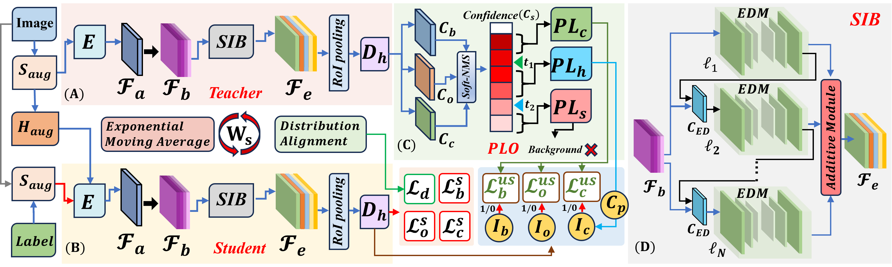
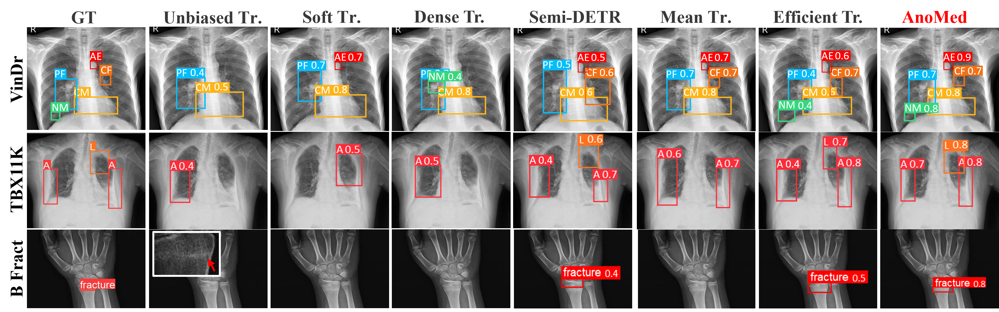
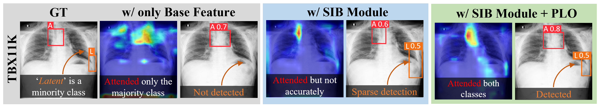

# 🌟 **AnoMed: Confidence-guided Semi-supervised Learning for Generalized Lesion Localization in X-ray Images**



## ✨ **Abstract**

In recent years, pseudo label (PL) based semi-supervised (SS) methods have been proposed for disease localization in medical images for tasks with limited labeled data. However, these models are not curated for chest x-rays containing anomalies of different shapes and sizes. As a result, existing methods suffer from biased attentiveness towards minor classes and PL inconsistency. Soft labeling-based methods filter out PLs with higher uncertainty but lead to a loss of fine-grained features of minor articulates, resulting in sparse prediction. To address these challenges, we propose **AnoMed**, an uncertainty-aware SS framework with a novel scale-invariant bottleneck (SIB) and confidence-guided pseudo-label optimizer (PLO). SIB leverages base features obtained from any encoder to capture multi-granular anatomical structures and underlying representations. PLO refines hesitant PLs and guides them separately for unsupervised loss, reducing inconsistency. Our extensive experiments on cardiac datasets and out-of-distribution (OOD) fine-tuning demonstrate that AnoMed outperforms other state-of-the-art (SOTA) methods like Efficient Teacher and Mean Teacher with improvements of 4.9 and 5.9 in AP50:95 on VinDr-CXR data.

## 🚀 **Key Contributions**

1. **🔍 Scale Invariant Bottleneck (SIB):** An innovative layered encoding-decoding bottleneck that captures local to global features of diseases, regardless of their size and scale.
2. **🤖 Uncertainty-guided Pseudo Label Optimizer (PLO):** A novel component that refines pseudo labels based on confidence, preventing inconsistent model updates and enhancing mutual learning.
3. **🌐 Out-of-distribution Fine-tuning:** AnoMed has been fine-tuned on out-of-distribution data, allowing it to generalize better to unseen cases.





## 📁 **Project Structure**

```
AnoMed/
│
├── config/
│   └── config.yaml           # Configuration files for the project
├── data/
│   ├── loaders.py            # Custom DataLoader implementations
│   └── datasets/             # Folder for datasets (optional)
├── experiments/
│   ├── train.py              # Script for training the model
│   ├── validate.py           # Script for validating the model
│   └── test.py               # Script for testing the model
├── models/
│   ├── encoder.py            # Encoder (e.g., ResNet50)
│   ├── sib.py                # Scale Invariant Bottleneck (SIB)
│   ├── fa.py                 # Feature Aggregator (Fa)
│   ├── plo.py                # Pseudo Label Optimizer (PLO)
│   └── detector.py           # Detection head and loss functions
├── utils/
│   ├── logger.py             # Custom logging functionality
│   ├── metrics.py            # Evaluation metrics (AP50, AP50:95, etc.)
│   └── visualization.py      # Visualization tools
|
├── requirements.txt          # Python dependencies
├── LICENSE                   # License information
└── README.md                 # Project documentation
```

## 🛠️ **Installation**

1. **Clone the Repository**:
   ```bash
   git clone https://github.com/yourusername/AnoMed.git
   cd AnoMed
   ```

2. **Install Dependencies**:
   ```bash
   pip install -r requirements.txt
   ```

3. **Download and Prepare Datasets**:
   - Ensure your dataset is prepared and organized with images and annotations in JSON format.
   - Update the `config.yaml` file with the correct paths to your data.

## 🧩 **Unique Components**

### 🔍 Scale Invariant Bottleneck (SIB)
The SIB module is designed to capture multi-granular features of anomalies at various scales, enhancing the model's ability to detect both large and small lesions in X-ray images. The SIB is implemented in the `models/sib.py` file and integrates seamlessly with the encoder.

### 🤖 Pseudo Label Optimizer (PLO)
PLO refines pseudo labels by categorizing them into confident, hesitant, and scrap categories based on the model's confidence. Hesitant labels are guided separately to improve consistency in training. The PLO is implemented in `models/plo.py`.

## 🏋️‍♂️ **Training the Model**

1. **Configure Training Parameters**:
   - Edit the `config/config.yaml` file to adjust learning rates, batch sizes, number of epochs, and other hyperparameters.

2. **Start Training**:
   ```bash
   python experiments/train.py --config config/config.yaml
   ```
   This command will start training the model based on the parameters defined in the configuration file.

3. **Monitor Training**:
   - Logs will be saved in `train.log`.
   - You can visualize training progress using tools like TensorBoard or directly checking the logs.

## 📊 **Validating the Model**

After training, you can validate the model's performance on the validation set.

```bash
python experiments/validate.py --config config/config.yaml
```

Validation metrics, such as AP50 and AP50:95, will be printed out and can be used to assess the model's performance.

## 🔍 **Testing the Model**

To test the model on a separate test set, run:

```bash
python experiments/test.py --config config/config.yaml
```

Test results, including AP50 and AP50:95, will be displayed, helping you evaluate the model's performance on unseen data.

## 🛠️ **Inference**

You can perform inference on new X-ray images using the trained model.

```python
import torch
from models.encoder import ResNet50Encoder
from models.sib import ScaleInvariantBottleneck
from models.fa import FeatureAggregator
from models.detector import DetectionHead
from utils.visualization import visualize_bboxes
from PIL import Image

# Load the trained model
device = torch.device("cuda" if torch.cuda.is_available() else "cpu")
encoder = ResNet50Encoder().to(device)
sib = ScaleInvariantBottleneck(in_channels=2048).to(device)
fa = FeatureAggregator(in_channels_list=[512, 1024, 2048]).to(device)
detector = DetectionHead(in_channels=2048, num_classes=5).to(device)

encoder.load_state_dict(torch.load("path/to/encoder.pth"))
sib.load_state_dict(torch.load("path/to/sib.pth"))
fa.load_state_dict(torch.load("path/to/fa.pth"))
detector.load_state_dict(torch.load("path/to/detector.pth"))

encoder.eval()
sib.eval()
fa.eval()
detector.eval()

# Load an image and perform inference
image = Image.open("path/to/image.jpg").convert("RGB")
image_tensor = transforms.ToTensor()(image).unsqueeze(0).to(device)

with torch.no_grad():
    features = encoder(image_tensor)
    features = sib(features)
    features = fa(features)
    bbox_out, class_out, obj_out = detector(features)

visualize_bboxes(image, bbox_out.squeeze().cpu().numpy(), labels=class_out.argmax(dim=1).cpu().numpy())
```

This code snippet allows you to perform inference on any new X-ray image and visualize the predicted bounding boxes.

## 📜 **License**

This project is licensed under the MIT License - see the [LICENSE](LICENSE) file for details.

